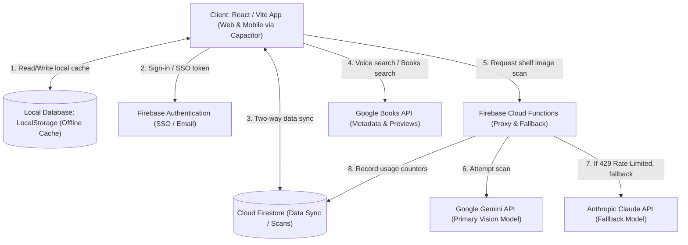
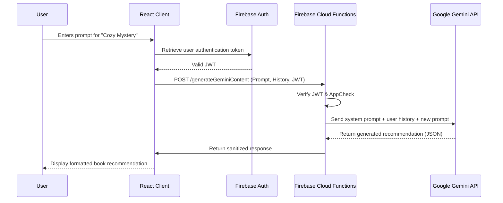

# Lumina

<div align="center">
  
</div>


🌐 **Live Demo**
https://luminapro.web.app/


📱 **Android**
Google Play (Closed Testing)

💻 **GitHub**
https://github.com/Shilpi924


## Project Status

🚀 Active Development

- 🌐 Live Web Application
- 📱 Android App (Google Play Closed Testing)
- 🔄 Regular feature updates

## Why I Built Lumina

As an avid reader and software engineer transitioning into AI, I wanted to build an application that combines artificial intelligence with everyday reading.

Lumina helps users discover books, organize their libraries, scan physical books, interact using voice, and receive personalized AI recommendations.

This project allowed me to explore modern AI engineering, backend development, cloud deployment, and cross-platform mobile development.

## My Contributions

I developed and integrated the core functionality of Lumina, including:

- Built the React-based web and mobile user interface
- Integrated Firebase Authentication, Firestore, and Cloud Functions
- Connected Anthropic Claude Opus 4.8 for AI-powered recommendations and image understanding
- Integrated Google Books API for book metadata and search
- Implemented AI prompt workflows for personalized recommendations
- Built and tested the Android application using Capacitor
- Deployed the web application using Firebase Hosting
- Tested, debugged, and refined application features

---

## 1. Project Overview
Lumina is a modern, AI-powered mobile web application designed to help readers organize their personal libraries, discover new books through AI recommendations, and track their reading journeys. Built with cutting-edge web and native technologies, it bridges the gap between a physical bookshelf and a digital reading tracker.

## Project Highlights
- AI-powered web and Android application
- Live production deployment
- Google Play Closed Testing
- Voice Assistant
- Image Understanding
- Personalized Book Recommendations
- AI Memory
- Multi-language support
- Firebase Authentication
- Cloud Firestore
- Anthropic Claude Opus 4.8 Integration

## Project Statistics
- 5+ major AI features
- Cross-platform (Web + Android)
- Firebase cloud backend
- Real-time data synchronization
- AI-powered recommendation engine

## 2. Features
- **Voice Assistant**: Integrated speech recognition for hands-free searching and interactions.
- **Image Understanding**: Scan physical books and shelves utilizing advanced AI image analysis.
- **Personalized Book Recommendations**: Receive AI-driven, highly tailored book suggestions based on your unique tastes.
- **AI Context**: Seamlessly injects your saved library and reading preferences into the system prompt for highly personalized book recommendations.
- **Multi-language Support**: Built to interact and provide recommendations across multiple languages.

## 3. Screenshots

### Home Page


### AI Chat


### Book Search Results


### Mobile View


### Login Page


## 4. Tech Stack
### Frontend & Build
*   **[React](https://react.dev/)**: Core UI library.
*   **[Vite](https://vitejs.dev/)**: Next-generation, blazing fast frontend tooling.
*   **Vanilla CSS**: Custom, highly-optimized styling system with light/dark/classic themes.

### Native & Mobile
*   **[Capacitor](https://capacitorjs.com/)**: Cross-platform native runtime for building iOS and Android apps from web code.
*   **RevenueCat**: In-App Purchase management for "Beta Plus" subscriptions.

### Backend & Cloud
*   **[Firebase](https://firebase.google.com/)**: Authentication, Cloud Functions, and Firestore NoSQL database for real-time library syncing.
*   **[Google Gemini API (Primary)](https://deepmind.google/technologies/gemini/)**: Primary Large Language Model and Vision integration for analyzing physical book covers and generating highly personalized reading recommendations.
*   **[Anthropic Claude API (Fallback)](https://www.anthropic.com/claude)**: Intelligent fallback model triggered seamlessly via Cloud Functions to ensure high availability during Gemini rate limits.
### Testing
*   **[Vitest](https://vitest.dev/)**: Extremely fast unit testing for custom hooks and data logic.
*   **[Playwright](https://playwright.dev/)**: End-to-end browser testing for complex UI interactions and authentication flows.

## 5. Project Architecture ⭐

### 5.1 System Architecture

To help you understand the system at a glance, here is a simplified view of the application flow:

User
↓
Lumina (React Frontend)
↓
Firebase (Auth & Cloud Functions)
↓
Google Gemini API & Google Books API
↓
Results

*For a more detailed technical breakdown, see the flow diagram below:*



### 5.2 AI Workflow

1. User asks a question
↓
2. Intent Detection
↓
3. Book Search
↓
4. Gemini analyzes
↓
5. Recommendation Engine
↓
6. Personalized response
↓
7. Save interaction
↓
8. Display result

### 5.3 Database Schema

Lumina relies on Cloud Firestore with a NoSQL document-based schema.

#### `users` Collection
Stores registered user credentials, profile information, and login history.
* **Path**: `/users/{userId}`
* **Key Fields**: `uid` (string), `email` (string), `displayName` (string), `lastLoginAt` (timestamp).

#### `appData` Collection (User State Sync)
Contains the serialized client state document. This allows a user to sign in on a new device and immediately restore their custom lists and library cards.
* **Path**: `/users/{userId}/appData/bookCompass` *(Note: `bookCompass` is a legacy document identifier maintained in the codebase)*
* **Key Fields**: 
  - `readingList` (array of objects): Books saved in reading lists (title, author, rating).
  - `folders` (array of strings): Custom and default user folders.
  - `libraryCards` (array of objects): Stored digital library cards with barcode formats and base64 images.
  - `geminiUsage` (object): Daily API counters to track AI requests.

#### `scans` Collection
Tracks detailed history of raw bookshelf scan data.
* **Path**: `/users/{userId}/scans/{scanId}`
* **Key Fields**: `image` (map containing metadata), `timestamp`, `aiResponse` (raw AI parsed output).

### 5.4 Sequence Diagram (AI Chat Flow)

This sequence diagram illustrates the communication flow when a user requests a personalized AI book recommendation via chat.



### 5.5 Architecture Decisions

#### Why Firebase?
Firebase provides authentication, Cloud Functions, and Firestore in a fully managed platform, reducing operational overhead.

#### Why Gemini?
Gemini offers multimodal capabilities, enabling both text generation and image understanding for book cover and bookshelf analysis.

#### Why Capacitor?
Capacitor allows a single React codebase to be deployed as both a web application and native Android application.

## 6. Challenges Solved
### AI Model Reliability
Implemented a fallback from Gemini to Claude when the primary model is unavailable or rate-limited.

### Prompt Engineering
Refined prompts to improve recommendation quality and reduce inconsistent outputs.

### Offline Experience
Used local caching with synchronization to Cloud Firestore when connectivity is restored.

## 7. AI Features
### Feature: Personalized Reading Recommendations
Users can request highly tailored recommendations based on specific moods like "Cozy Mystery" or "Lighthearted Fantasy." When a user makes a request:

**Prompt (Internal to Gemini):**
> "The user wants a 'Cozy reset ☕' vibe. Analyze their current library and suggest 3 globally acclaimed books that perfectly match this mood. No placeholders."

**Output (Rendered in UI):**
> *The House in the Cerulean Sea* by TJ Klune
> "A magical, heartwarming story about found family and acceptance. Perfect for wrapping yourself in a warm blanket of a book."

## 8. Folder Structure
```text
Lumina-app-new/
├── android/               # Native Android Capacitor files
├── e2e/                   # Playwright end-to-end tests
├── functions/             # Firebase Cloud Functions backend
├── play-store-assets/     # Promotional images and screenshots
├── public/                # Static assets
├── src/                   # React source code (components, services, hooks)
│   ├── components/
│   ├── services/
│   ├── utils/
│   └── test/              # Unit tests
├── TECHNICAL_DOCUMENTATION.md
├── firebase.json          # Firebase configuration
├── package.json
└── vite.config.js         # Vite bundler configuration
```

## 9. Installation

To run Lumina locally, follow these steps:

### Prerequisites
*   Node.js 18.x or higher
*   npm or yarn
*   A Firebase Project
*   A Google Gemini API Key

### Steps

1. **Clone the repository:**
   ```bash
   git clone https://github.com/Shilpi924/lumina-app.git
   cd lumina-app
   ```

2. **Install dependencies:**
   ```bash
   npm install
   ```

3. **Set up environment variables:**
   Create a `.env.local` file in the root directory and add your Firebase and Gemini credentials:
   ```env
   VITE_FIREBASE_API_KEY=your_api_key
   VITE_FIREBASE_AUTH_DOMAIN=your_auth_domain
   VITE_FIREBASE_PROJECT_ID=your_project_id
   VITE_FIREBASE_STORAGE_BUCKET=your_storage_bucket
   VITE_FIREBASE_MESSAGING_SENDER_ID=your_messaging_sender_id
   VITE_FIREBASE_APP_ID=your_app_id
   VITE_GEMINI_API_KEY=your_gemini_api_key
   ```

4. **Start the development server:**
   ```bash
   npm run dev
   ```

5. **Run the testing suites:**
   ```bash
   # Run logic tests
   npm run test
   
   # Run UI tests
   npx playwright test
   ```

## 10. AI Roadmap
- Multi-agent architecture
- RAG
- Vector database
- Local LLM support
- Personalized AI Memory
- Fine-tuned recommendations
- Voice conversation
- OCR

## 11. About the Developer

**Shilpi Sharma**

AI Software Engineer
Generative AI Engineer

GitHub:
https://github.com/Shilpi924

Live App:
https://luminapro.web.app/

Currently building AI-powered applications using
• React
• Gemini
• Firebase
