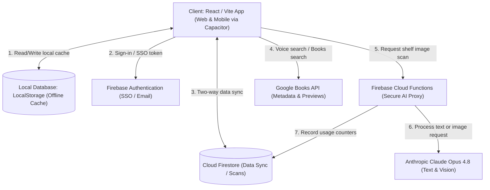

# BookCompass — Technical Documentation

This document describes the architectural layout, communication patterns, Firebase integrations, and complete database schemas of the **BookCompass** application.

---

## 🏛️ System Architecture

BookCompass is a cross-platform mobile and web application built using React, Vite, and Capacitor. It operates as a hybrid app with offline-first client storage synced to Firebase in the cloud.

### Architecture Flow Diagram



---

## 🔌 Firebase Integrations

The app relies on Firebase services for authentication, configuration protection, proxy processing, and database sync.

### 1. Firebase App Check
* **Purpose**: Prevents unauthorized API access and abuse of Claude endpoints.
* **Details**: Protects HTTP Callable Cloud Functions using **reCAPTCHA v3**. Validated automatically in `src/firebase.js`.

### 2. Firebase Authentication
* **Providers**: 
  - Standard Email / Password.
  - Google Sign-In (using native `@capacitor-firebase/authentication` on Android/iOS and standard redirect on web).
  - Anonymous Guest authentication (for initial onboarding limits).
* **Code Implementation**: Handled in `src/App.jsx` inside the `onAuthStateChanged` hook.

### 3. Firebase Cloud Functions (`generateClaudeContent`)
* **Endpoint Type**: `onCall` Https v2 callable function.
* **Role**: 
  - Validates authentication tokens.
  - Generates signatures and credentials safely away from the client browser.
  - Sends all AI requests to **Claude Opus 4.8**. The legacy `generateGeminiContent` callable remains only for older app versions and uses the same Claude-only handler.
  - Records API metadata to Firestore collections.

---

## 🗄️ Firestore Database Schema

Firestore database schemas are split into user documents, application-specific data objects, and developer analytical collections.

---

### 1. `users` Collection
Stores registered user credentials, profile information, and last login dates.

* **Path**: `/users/{userId}`

| Field | Type | Description |
|---|---|---|
| `uid` | `string` | The unique Firebase Auth ID of the user. |
| `email` | `string` | User's email address. |
| `displayName` | `string` | User's chosen or auto-generated name. |
| `emailVerified` | `boolean` | Verification status of the user's email. |
| `lastLoginAt` | `timestamp` | Time of the user's last login event. |
| `loginCount` | `number` | Total number of times this user has logged in (incremented server-side). |
| `provider` | `string` | Login provider type (e.g., `google`, `password`). |
| `updatedAt` | `timestamp` | Server-recorded timestamp of the last update. |

---

### 2. `appData` Collection (User State Sync)
Contains the serialized client state document. This allows a user to sign in on a new device and immediately restore their custom lists and library cards.

* **Path**: `/users/{userId}/appData/bookCompass`

| Field | Type | Description |
|---|---|---|
| `readingList` | `array (objects)` | Books saved in reading lists (contains keys like title, author, rating, genre). |
| `savedFiles` | `array (objects)` | Local files, previews, and metadata caches. |
| `folders` | `array (strings)` | List of folders (Want to read, Favorites, plus custom folders). |
| `bookFolders` | `map (string -> string)` | Map mapping the `bookKey` to a specific folder name. |
| `libraryCards` | `array (objects)` | Nested objects containing `id`, `name`, `cardNumber`, `barcodeFormat`, `imageDataUrl` (base64 image). |
| `scanHistory` | `array (objects)` | Brief metadata of the user's recent scanned shelves (limit: 30 entries). |
| `filters` | `object` | Currently active filter states on the shelf interface. |
| `geminiUsage` | `object` | Daily local API counters. |
| `updatedAt` | `timestamp` | Firestore server timestamp of state sync. |

---

### 3. `scans` Collection
Tracks detailed history of raw bookshelf scan data. This is logged to let users review past bookshelf photos and raw AI responses.

* **Path**: `/users/{userId}/scans/{scanId}`

| Field | Type | Description |
|---|---|---|
| `bookCount` | `number` | Total number of books successfully identified on the shelf. |
| `books` | `array (objects)` | Array of detected book metadata returned by the AI (detailed below). |
| `filters` | `object` | Active filters at the time of scan. |
| `image` | `map` | Image metadata containing `name` (string), `type` (string), and `size` (number). |
| `model` | `string` | The AI model used (e.g. `gemini-2.5-flash-lite`, `claude-3-5-sonnet`). |
| `provider` | `string` | The backend provider used (`gemini` or `claude`). |
| `promptTokens` | `number` | Tokens used in the input prompt. |
| `totalTokens` | `number` | Total token consumption of this scan call. |
| `scannedAtLocalDate` | `string` | Local format string representation of the scan date. |
| `createdAt` | `timestamp` | Server timestamp when the scan record was logged. |

#### **Nested Book Structure inside `books` array**:
```json
{
  "title": "Clean Code",
  "author": "Robert C. Martin",
  "authorBio": "Robert Cecil Martin, colloquially known as Uncle Bob, is an American software engineer...",
  "rating": 4.4,
  "ratingSource": "Goodreads",
  "summary": "A handbook of agile software craftsmanship...",
  "genre": "Computers",
  "readingLevel": "Advanced",
  "gradeBand": "7+",
  "ageRecommendation": "Adult",
  "whyRead": "Essential reading for writing professional code.",
  "shelfPick": "Top Rated",
  "shelfLocation": "top row left side",
  "scanConfidence": "looks correct",
  "confidenceReason": "Title and metadata look complete.",
  "reviewed": false
}
```

---

### 4. `loginEvents` Collection (Analytics)
Stores flat log streams of user logins for security and analytics auditing.

* **Path**: `/loginEvents/{eventId}`

| Field | Type | Description |
|---|---|---|
| `userId` | `string` | Firebase Auth UID of the logging user. |
| `email` | `string` | Audited user email. |
| `displayName` | `string` | Display name at the time of login. |
| `method` | `string` | Login protocol used (`password` or `google`). |
| `date` | `string` | Local date string (`YYYY-MM-DD`). |
| `createdAtMs` | `number` | Epoch millisecond timestamp of the event. |
| `createdAt` | `timestamp` | Firestore server timestamp. |

---

### 5. `developerApiUsage` Collection (Global Metrics)
A daily counter tracking system-wide API calls, success/failure rates, and model metrics. Used by developers to manage API cost allocations.

* **Path**: `/developerApiUsage/{dateKey}` (e.g., `/developerApiUsage/2026-06-25`)

| Field | Type | Description |
|---|---|---|
| `date` | `string` | The date of these counters (`YYYY-MM-DD`). |
| `apiCalls` | `number` | Total calls made today. |
| `promptTokens` | `number` | Total input tokens consumed. |
| `outputTokens` | `number` | Total output tokens consumed. |
| `totalTokens` | `number` | Grand total of tokens. |
| `successCalls` | `number` | Count of successful requests. |
| `failedCalls` | `number` | Count of failed requests. |
| `lastCallType` | `string` | Type of the most recent API call. |
| `lastStatus` | `string` | Status of the last call (`Success` or `Failed`). |
| `lastProvider` | `string` | Last model provider (`gemini` or `claude`). |
| `lastModel` | `string` | Last model ID used. |
| `lastUserEmail` | `string` | Email of the user who made the last request. |
| `lastIpAddress` | `string` | Client IP address of the last request. |
| `updatedAt` | `timestamp` | Server timestamp of the last call update. |

---

### 6. `developerApiUsageEvents` Collection
A detailed, flat audit log of every backend API transaction. This is queried inside the Developer Settings panel for live tracking.

* **Path**: `/developerApiUsageEvents/{eventId}`

| Field | Type | Description |
|---|---|---|
| `date` | `string` | Date of the transaction (`YYYY-MM-DD`). |
| `callType` | `string` | Purpose of call (e.g., `Bookshelf scan`). |
| `status` | `string` | Outcome status (`Success` or `Failed`). |
| `provider` | `string` | Cloud provider (`gemini` or `claude`). |
| `model` | `string` | Exact model name string. |
| `promptTokens` | `number` | Input prompt tokens count. |
| `outputTokens` | `number` | Output generated tokens count. |
| `totalTokens` | `number` | Total tokens count. |
| `userId` | `string` | User ID who initiated the call. |
| `userEmail` | `string` | User email. |
| `ipAddress` | `string` | Request client IP address. |
| `createdAt` | `timestamp` | Server timestamp when event was logged. |

---

## 🔀 Data Synchronization Logic

When a user signs in, local database structures must merge with cloud structures:

```
[Local State (localStorage)]  <---+
                                  |
                                  v
                         [Merge Resolution]
                                  |
                                  +-----> [Merged State Saved to Cloud Firestore]
                                  |
                                  v
                      [App React State Refreshed]
```

1. **Conflict Resolution Strategy**:
   - Lists (`readingList`, `savedFiles`, `books`, `scanHistory`, `libraryCards`) are merged using the unique key index (`getBookKey` or file/card ID) using union logic:
     - `localItems ∪ cloudItems`
   - Custom folders are merged uniquely.
   - For configuration options (like custom `filters`), the local filter is preferred if active filters are set, otherwise fallback to the cloud filter settings.
   - For `geminiUsage`, local daily limits are combined with cloud usage counters.
2. **Synchronization Interval**:
   - Synced on auth state change.
   - Synced via a debounced write timer (500ms delay) triggered whenever local React states (`readingList`, `savedFiles`, `folders`, `libraryCards`, etc.) change.
